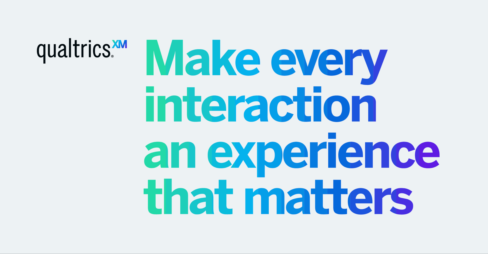

<div align="left">

[](https://api.qualtrics.com)

# [Qualtrics](https://api.qualtrics.com)<a id="qualtrics"></a>

The Qualtrics Survey endpoints give you access to the structure of the surveys you create. 

Surveys have a complex structure, and you are encouraged to become familiar with the structure using your brand's Qualtrics page to build surveys at first. Then you can query those surveys using these endpoints. 

Once you are familiar, you can use this API to create surveys on the fly, or modify existing surveys in your library. 

</div>

## Table of Contents<a id="table-of-contents"></a>

<!-- toc -->

- [Installation](#installation)
- [Getting Started](#getting-started)
- [Reference](#reference)
  * [`qualtrics.surveyBlocks.createNewBlock`](#qualtricssurveyblockscreatenewblock)
  * [`qualtrics.surveyBlocks.getDefinitionBlock`](#qualtricssurveyblocksgetdefinitionblock)
  * [`qualtrics.surveyBlocks.removeBlock`](#qualtricssurveyblocksremoveblock)
  * [`qualtrics.surveyBlocks.updateDefinitionBlock`](#qualtricssurveyblocksupdatedefinitionblock)
  * [`qualtrics.surveyFlows.getFlowDefinition`](#qualtricssurveyflowsgetflowdefinition)
  * [`qualtrics.surveyFlows.updateDefinition`](#qualtricssurveyflowsupdatedefinition)
  * [`qualtrics.surveyFlows.updateFlowElementDefinition`](#qualtricssurveyflowsupdateflowelementdefinition)
  * [`qualtrics.surveyLanguages.getAvailableLanguages`](#qualtricssurveylanguagesgetavailablelanguages)
  * [`qualtrics.surveyLanguages.updateEnabledLanguages`](#qualtricssurveylanguagesupdateenabledlanguages)
  * [Permissions](#permissions)
  * [`qualtrics.surveyOptions.getOptions`](#qualtricssurveyoptionsgetoptions)
  * [`qualtrics.surveyOptions.updateOptions`](#qualtricssurveyoptionsupdateoptions)
  * [`qualtrics.surveyQuestions.createNewQuestion`](#qualtricssurveyquestionscreatenewquestion)
  * [`qualtrics.surveyQuestions.getDefinition`](#qualtricssurveyquestionsgetdefinition)
  * [`qualtrics.surveyQuestions.getList`](#qualtricssurveyquestionsgetlist)
  * [`qualtrics.surveyQuestions.removeQuestion`](#qualtricssurveyquestionsremovequestion)
  * [`qualtrics.surveyQuestions.updateDefinition`](#qualtricssurveyquestionsupdatedefinition)
  * [`qualtrics.surveyQuotas.createNewQuota`](#qualtricssurveyquotascreatenewquota)
  * [`qualtrics.surveyQuotas.createQuotaGroup`](#qualtricssurveyquotascreatequotagroup)
  * [`qualtrics.surveyQuotas.deleteQuota`](#qualtricssurveyquotasdeletequota)
  * [`qualtrics.surveyQuotas.getAll`](#qualtricssurveyquotasgetall)
  * [`qualtrics.surveyQuotas.getDefinition`](#qualtricssurveyquotasgetdefinition)
  * [`qualtrics.surveyQuotas.getQuotaGroupDefinition`](#qualtricssurveyquotasgetquotagroupdefinition)
  * [`qualtrics.surveyQuotas.listQuotaGroups`](#qualtricssurveyquotaslistquotagroups)
  * [`qualtrics.surveyQuotas.removeQuotaGroup`](#qualtricssurveyquotasremovequotagroup)
  * [`qualtrics.surveyQuotas.updateDefinition`](#qualtricssurveyquotasupdatedefinition)
  * [`qualtrics.surveyQuotas.updateQuotaGroupDefinition`](#qualtricssurveyquotasupdatequotagroupdefinition)
  * [`qualtrics.surveyTranslations.getBySurveyIdAndLanguageCode`](#qualtricssurveytranslationsgetbysurveyidandlanguagecode)
  * [`qualtrics.surveyTranslations.updateTranslations`](#qualtricssurveytranslationsupdatetranslations)
  * [Permissions](#permissions-1)
  * [`qualtrics.surveyVersions.createNewVersion`](#qualtricssurveyversionscreatenewversion)
  * [`qualtrics.surveyVersions.getDefinition`](#qualtricssurveyversionsgetdefinition)
  * [`qualtrics.surveyVersions.list`](#qualtricssurveyversionslist)
  * [`qualtrics.surveys.createDefinition`](#qualtricssurveyscreatedefinition)
  * [`qualtrics.surveys.getDefinition`](#qualtricssurveysgetdefinition)
  * [`qualtrics.surveys.getMetadata`](#qualtricssurveysgetmetadata)
  * [`qualtrics.surveys.removeDefinition`](#qualtricssurveysremovedefinition)
  * [`qualtrics.surveys.updateMetadata`](#qualtricssurveysupdatemetadata)
  * [Date fields in this API use MySQL DateTime instead of ISO-8601.](#date-fields-in-this-api-use-mysql-datetime-instead-of-iso-8601)

<!-- tocstop -->

## Installation<a id="installation"></a>
<div align="center">
  <a href="https://konfigthis.com/sdk-sign-up?company=Qualtrics&serviceName=Survey&language=TypeScript">
    
  </a>
</div>

## Getting Started<a id="getting-started"></a>

```typescript
import { Qualtrics } from "qualtrics-survey-typescript-sdk";

const qualtrics = new Qualtrics({
  // Defining the base path is optional and defaults to https://yul1.qualtrics.com/API/v3
  // basePath: "https://yul1.qualtrics.com/API/v3",
  apiKey: "API_KEY",
  oauthClientId: "CLIENT_ID",
  oauthClientSecret: "CLIENT_SECRET",
});

const createNewBlockResponse = await qualtrics.surveyBlocks.createNewBlock({
  surveyId: "SV_0ODVm59K4i9tjcp",
  Type: "Standard",
  SubType: "Reference",
  ID: "BL_d7tGuyhg0ec00PH",
  Description: "Description_example",
  LibraryID: "UR_Cu2LC4aWwWL",
  ReferencedBlockID: "LB_39jTPoKafNaUF9z",
});

console.log(createNewBlockResponse);
```

## Reference<a id="reference"></a>


### `qualtrics.surveyBlocks.createNewBlock`<a id="qualtricssurveyblockscreatenewblock"></a>

Create a new [block](https://www.qualtrics.com/support/survey-platform/survey-module/block-options/block-options-overview/).

#### 🛠️ Usage<a id="🛠️-usage"></a>

```typescript
const createNewBlockResponse = await qualtrics.surveyBlocks.createNewBlock({
  surveyId: "SV_0ODVm59K4i9tjcp",
  Type: "Standard",
  SubType: "Reference",
  ID: "BL_d7tGuyhg0ec00PH",
  Description: "Description_example",
  LibraryID: "UR_Cu2LC4aWwWL",
  ReferencedBlockID: "LB_39jTPoKafNaUF9z",
});
```

#### ⚙️ Parameters<a id="⚙️-parameters"></a>

##### surveyId: `string`<a id="surveyid-string"></a>

##### BlockElements: [`BlockElementsInner`](./models/block-elements-inner.ts)[]<a id="blockelements-blockelementsinnermodelsblock-elements-innerts"></a>

All of the elements contained by the block

##### Type: `string`<a id="type-string"></a>

##### SubType: `string`<a id="subtype-string"></a>

Choice Based Conjoint Blocks hide their elements from editing using the Group Flow element and ViewFlow: false

##### ID: `string`<a id="id-string"></a>

The ID of the survey\\\'s default block.

##### Description: `string`<a id="description-string"></a>

##### LibraryID: [`LibraryID`](./models/library-id.ts)<a id="libraryid-libraryidmodelslibrary-idts"></a>

##### ReferencedBlockID: `string`<a id="referencedblockid-string"></a>

The unique identifier for the Reference Block.

##### Options: [`BlockOptions`](./models/block-options.ts)<a id="options-blockoptionsmodelsblock-optionsts"></a>

#### 🔄 Return<a id="🔄-return"></a>

[CreateBlockResponse](./models/create-block-response.ts)

#### 🌐 Endpoint<a id="🌐-endpoint"></a>

`/survey-definitions/{surveyId}/blocks` `POST`

[🔙 **Back to Table of Contents**](#table-of-contents)

---


### `qualtrics.surveyBlocks.getDefinitionBlock`<a id="qualtricssurveyblocksgetdefinitionblock"></a>

Retrieve a [block](https://www.qualtrics.com/support/survey-platform/survey-module/block-options/block-options-overview/) definition.

#### 🛠️ Usage<a id="🛠️-usage"></a>

```typescript
const getDefinitionBlockResponse =
  await qualtrics.surveyBlocks.getDefinitionBlock({
    surveyId: "SV_0ODVm59K4i9tjcp",
    blockId: "BL_d7tGuyhg0ec00PH",
  });
```

#### ⚙️ Parameters<a id="⚙️-parameters"></a>

##### surveyId: `string`<a id="surveyid-string"></a>

##### blockId: `string`<a id="blockid-string"></a>

#### 🔄 Return<a id="🔄-return"></a>

[GetBlockResponse](./models/get-block-response.ts)

#### 🌐 Endpoint<a id="🌐-endpoint"></a>

`/survey-definitions/{surveyId}/blocks/{blockId}` `GET`

[🔙 **Back to Table of Contents**](#table-of-contents)

---


### `qualtrics.surveyBlocks.removeBlock`<a id="qualtricssurveyblocksremoveblock"></a>

Delete a [block](https://www.qualtrics.com/support/survey-platform/survey-module/block-options/block-options-overview/) from the survey.

#### 🛠️ Usage<a id="🛠️-usage"></a>

```typescript
const removeBlockResponse = await qualtrics.surveyBlocks.removeBlock({
  surveyId: "SV_0ODVm59K4i9tjcp",
  blockId: "BL_d7tGuyhg0ec00PH",
});
```

#### ⚙️ Parameters<a id="⚙️-parameters"></a>

##### surveyId: `string`<a id="surveyid-string"></a>

##### blockId: `string`<a id="blockid-string"></a>

#### 🔄 Return<a id="🔄-return"></a>

[RequestSuccessfulResponse](./models/request-successful-response.ts)

#### 🌐 Endpoint<a id="🌐-endpoint"></a>

`/survey-definitions/{surveyId}/blocks/{blockId}` `DELETE`

[🔙 **Back to Table of Contents**](#table-of-contents)

---


### `qualtrics.surveyBlocks.updateDefinitionBlock`<a id="qualtricssurveyblocksupdatedefinitionblock"></a>

Update a [block](https://www.qualtrics.com/support/survey-platform/survey-module/block-options/block-options-overview/) definition.

#### 🛠️ Usage<a id="🛠️-usage"></a>

```typescript
const updateDefinitionBlockResponse =
  await qualtrics.surveyBlocks.updateDefinitionBlock({
    surveyId: "SV_0ODVm59K4i9tjcp",
    blockId: "BL_d7tGuyhg0ec00PH",
    Type: "Standard",
    SubType: "Reference",
    ID: "BL_d7tGuyhg0ec00PH",
    Description: "Description_example",
    LibraryID: "UR_Cu2LC4aWwWL",
    ReferencedBlockID: "LB_39jTPoKafNaUF9z",
  });
```

#### ⚙️ Parameters<a id="⚙️-parameters"></a>

##### surveyId: `string`<a id="surveyid-string"></a>

##### blockId: `string`<a id="blockid-string"></a>

##### BlockElements: [`BlockElementsInner`](./models/block-elements-inner.ts)[]<a id="blockelements-blockelementsinnermodelsblock-elements-innerts"></a>

All of the elements contained by the block

##### Type: `string`<a id="type-string"></a>

##### SubType: `string`<a id="subtype-string"></a>

Choice Based Conjoint Blocks hide their elements from editing using the Group Flow element and ViewFlow: false

##### ID: `string`<a id="id-string"></a>

The ID of the survey\\\'s default block.

##### Description: `string`<a id="description-string"></a>

##### LibraryID: [`LibraryID`](./models/library-id.ts)<a id="libraryid-libraryidmodelslibrary-idts"></a>

##### ReferencedBlockID: `string`<a id="referencedblockid-string"></a>

The unique identifier for the Reference Block.

##### Options: [`BlockOptions`](./models/block-options.ts)<a id="options-blockoptionsmodelsblock-optionsts"></a>

#### 🔄 Return<a id="🔄-return"></a>

[RequestSuccessfulResponse](./models/request-successful-response.ts)

#### 🌐 Endpoint<a id="🌐-endpoint"></a>

`/survey-definitions/{surveyId}/blocks/{blockId}` `PUT`

[🔙 **Back to Table of Contents**](#table-of-contents)

---


### `qualtrics.surveyFlows.getFlowDefinition`<a id="qualtricssurveyflowsgetflowdefinition"></a>

Retrieve a [flow](https://www.qualtrics.com/support/survey-platform/survey-module/survey-flow/survey-flow-overview/) definition.

#### 🛠️ Usage<a id="🛠️-usage"></a>

```typescript
const getFlowDefinitionResponse = await qualtrics.surveyFlows.getFlowDefinition(
  {
    surveyId: "SV_0ODVm59K4i9tjcp",
  }
);
```

#### ⚙️ Parameters<a id="⚙️-parameters"></a>

##### surveyId: `string`<a id="surveyid-string"></a>

#### 🔄 Return<a id="🔄-return"></a>

[GetFlowResponse](./models/get-flow-response.ts)

#### 🌐 Endpoint<a id="🌐-endpoint"></a>

`/survey-definitions/{surveyId}/flow` `GET`

[🔙 **Back to Table of Contents**](#table-of-contents)

---


### `qualtrics.surveyFlows.updateDefinition`<a id="qualtricssurveyflowsupdatedefinition"></a>

Update a [flow](https://www.qualtrics.com/support/survey-platform/survey-module/survey-flow/survey-flow-overview/) definition.

#### 🛠️ Usage<a id="🛠️-usage"></a>

```typescript
const updateDefinitionResponse = await qualtrics.surveyFlows.updateDefinition({
  surveyId: "SV_0ODVm59K4i9tjcp",
  FlowID: "FL_1",
  Type: "Authenticator",
  Flow: [
    {
      Type: "Authenticator",
      FlowID: "FL_1",
      PanelData: {
        LibraryID: "UR_3Cz41f8fIqINzaR",
        PanelID: "CG_0jjTqUJhwxz7KU5",
        Type: "Expression",
        LogicType: "Panel",
      },
      FieldData: {
        Type: "BooleanExpression",
      },
      FilterDataFields: true,
      SSOOptions: {
        CaptureRespondentInfo: "false",
        Type: "Token",
        UsePanel: "true",
        UsePerson: "true",
        UseSSO: "",
      },
      Options: {
        maxAttempts: 3,
        allowRetake: false,
        loadExistingSession: false,
      },
    },
  ],
  Properties: {
    Count: 2,
  },
});
```

#### ⚙️ Parameters<a id="⚙️-parameters"></a>

##### FlowID: `string`<a id="flowid-string"></a>

Unique identifier. Should be of form `FL_1`

##### Type: [`FlowType`](./models/flow-type.ts)<a id="type-flowtypemodelsflow-typets"></a>

Type of flow element. One of `Authenticator`, `Block`, `BlockRandomizer`, `Branch`, `Conjoint`, `EmbeddedData`, `EndSurvey`, `Group`, `QuotaCheck`, `ReferenceSurvey`, `Root`, `Standard`, `SupplementalData`, `TableOfContents`, `WebService`

##### Flow: [`FlowInner`](./models/flow-inner.ts)[]<a id="flow-flowinnermodelsflow-innerts"></a>

Definition of the inner flow elements (maximum of 5000)

##### Properties: [`FlowProperties`](./models/flow-properties.ts)<a id="properties-flowpropertiesmodelsflow-propertiests"></a>

##### surveyId: `string`<a id="surveyid-string"></a>

#### 🔄 Return<a id="🔄-return"></a>

[RequestSuccessfulResponse](./models/request-successful-response.ts)

#### 🌐 Endpoint<a id="🌐-endpoint"></a>

`/survey-definitions/{surveyId}/flow` `PUT`

[🔙 **Back to Table of Contents**](#table-of-contents)

---


### `qualtrics.surveyFlows.updateFlowElementDefinition`<a id="qualtricssurveyflowsupdateflowelementdefinition"></a>

Update [flow](https://www.qualtrics.com/support/survey-platform/survey-module/survey-flow/survey-flow-overview/) by ID.

If you're having trouble capturing single sign-on (SSO) information, make sure you've included all fields within the `Options` object. See this example:

```JSON
"Options": {
 "maxAttempts": 3,
 "authenticationError": {
 "SystemMessage": {
 "Section": "Message example",
 "Message": "Test System Message"
 }
 } 
 "failedAuthenticationError": {
 "SystemMessage": {
 "Section": "Message example",
 "Message": "Test System Message"
 }
 } 
 "questionText": "{
 "SystemMessage": {
 "Section": "Question Text section example",
 "Message": "Question Text message example"
 }
 } 
 "allowRetake": "true",
 "loadExistingSession": "false"
}


#### 🛠️ Usage

```typescript
const updateFlowElementDefinitionResponse =
  await qualtrics.surveyFlows.updateFlowElementDefinition({
    surveyId: "SV_0ODVm59K4i9tjcp",
    flowId: "FL_1",
    requestBody: [
      {
        Type: "Authenticator",
        FlowID: "FL_1",
        PanelData: {
          LibraryID: "UR_3Cz41f8fIqINzaR",
          PanelID: "CG_0jjTqUJhwxz7KU5",
          Type: "Expression",
          LogicType: "Panel",
        },
        FieldData: {
          Type: "BooleanExpression",
        },
        FilterDataFields: true,
        SSOOptions: {
          CaptureRespondentInfo: "false",
          Type: "Token",
          UsePanel: "true",
          UsePerson: "true",
          UseSSO: "",
        },
        Options: {
          maxAttempts: 3,
          allowRetake: false,
          loadExistingSession: false,
        },
      },
    ],
  });
```

#### ⚙️ Parameters

##### surveyId: `string`

##### flowId: `string`

##### requestBody: [`FlowInner`](./models/flow-inner.ts)[]

Update flow element request

#### 🔄 Return

[RequestSuccessfulResponse](./models/request-successful-response.ts)

#### 🌐 Endpoint

`/survey-definitions/{surveyId}/flow/{flowId}` `PUT`

[🔙 **Back to Table of Contents**](#table-of-contents)

---


### `qualtrics.surveyLanguages.getAvailableLanguages`

Returns a list of available [languages](https://www.qualtrics.com/support/survey-platform/getting-started/languages-in-qualtrics/) for a survey given the `surveyId`.

#### 🛠️ Usage

```typescript
const getAvailableLanguagesResponse =
  await qualtrics.surveyLanguages.getAvailableLanguages({
    surveyId: "surveyId_example",
  });
```

#### ⚙️ Parameters

##### surveyId: `string`

The unique identifier of the survey.

#### 🔄 Return

[LanguagesResponse](./models/languages-response.ts)

#### 🌐 Endpoint

`/surveys/{surveyId}/languages` `GET`

[🔙 **Back to Table of Contents**](#table-of-contents)

---


### `qualtrics.surveyLanguages.updateEnabledLanguages`

Updates enabled [languages](https://www.qualtrics.com/support/survey-platform/getting-started/languages-in-qualtrics/) given the `surveyId`.
<!--From Readme-->
For more information about using the survey APIs, see [Managing Surveys](../../../../docs/Guides/Common%20Tasks/managing-surveys.md).
<!-- theme: info -->

>### Permissions
>**Set Survey Options** permission must be enabled for the user to update survey languages.


#### 🛠️ Usage

```typescript
const updateEnabledLanguagesResponse =
  await qualtrics.surveyLanguages.updateEnabledLanguages({
    surveyId: "surveyId_example",
    AvailableLanguages: ["AvailableLanguages_example"],
  });
```

#### ⚙️ Parameters

##### AvailableLanguages: `string`[]

Array of language codes to enable.

##### surveyId: `string`

#### 🔄 Return

[RequestSuccessfulResponse](./models/request-successful-response.ts)

#### 🌐 Endpoint

`/surveys/{surveyId}/languages` `PUT`

[🔙 **Back to Table of Contents**](#table-of-contents)

---


### `qualtrics.surveyOptions.getOptions`

Retrieve [survey options](https://www.qualtrics.com/support/survey-platform/survey-module/survey-options/survey-options-overview/) for a survey with the `surveyId`.

#### 🛠️ Usage

```typescript
const getOptionsResponse = await qualtrics.surveyOptions.getOptions({
  surveyId: "SV_0ODVm59K4i9tjcp",
});
```

#### ⚙️ Parameters

##### surveyId: `string`

#### 🔄 Return

[GetSurveyOptionsResponse](./models/get-survey-options-response.ts)

#### 🌐 Endpoint

`/survey-definitions/{surveyId}/options` `GET`

[🔙 **Back to Table of Contents**](#table-of-contents)

---


### `qualtrics.surveyOptions.updateOptions`

Update [survey options](https://www.qualtrics.com/support/survey-platform/survey-module/survey-options/survey-options-overview/) for a survey with the `surveyId`.

#### 🛠️ Usage

```typescript
const updateOptionsResponse = await qualtrics.surveyOptions.updateOptions({
  surveyId: "SV_0ODVm59K4i9tjcp",
  AnonymizeResponse: "false",
  BackButton: false,
  BallotBoxStuffingPrevention: false,
  BallotBoxStuffingPreventionBehavior: "default",
  BallotBoxStuffingPreventionMessage: "MS_abcdefg12345",
  BallotBoxStuffingPreventionMessageLibrary: "UR_SomeUserId001",
  CollectGeoLocation: "true",
  CustomStyles: "[]",
  EmailThankYou: "false",
  EOSMessage: "MS_abcdefg12345",
  headerMid: "MS_abcdefg12345",
  Header: "",
  footerMid: "MS_abcdefg12345",
  Footer: "",
  InactiveSurvey: "DefaultMessage",
  InactiveMessage: "MS_abcdefg12345",
  InactiveMessageLibrary: "UR_SomeUserId001",
  NoIndex: "true",
  nextButtonMid: "MS_abcdefg12345",
  NextButton: " ← ",
  PageTransition: "None",
  PartialData: "+1 week",
  PartialDataCloseAfter: "",
  PasswordProtection: "false",
  previousButtonMid: "MS_abcdefg12345",
  PreviousButton: " ← ",
  ProgressBarDisplay: "None",
  RecaptchaV3: "true",
  RefererCheck: "false",
  ResponseSummary: "false",
  SaveAndContinue: true,
  SecureResponseFiles: "true",
  Skin: {
    templateId: "*base",
  },
  SurveyExpiration: "true",
  SurveyLanguage: "AR",
  SurveyProtection: "PublicSurvey",
  SurveyTermination: "DefaultMessage",
  ThankYouEmailMessage: "MS_abcdefg12345",
  ThankYouEmailMessageLibrary: "UR_SomeUserId001",
  ValidateMessage: "false",
  ValidationMessage: "MS_abcdefg12345",
  ValidationMessageLibrary: "UR_SomeUserId001",
});
```

#### ⚙️ Parameters

##### BackButton: `boolean`

If true, display the back button

##### BallotBoxStuffingPrevention: `boolean`

If true, prevent respondents from taking the survey multiple times.

##### Header: `string`

Header to display on each page such as a logo. Do not use in conjunction with `headerMid`.

##### Footer: `string`

Footer to display on each page such as a logo. Do not use in conjunction with `footerMid`.

##### NoIndex: [`NoIndex`](./models/no-index.ts)

Prevent search engines from indexing the survey.

##### NextButton: `string`

The text to use as the \\\"next\\\" Button. Note that `BackButton` should be enabled for this property to be used. See `nextButtonMid` and `BackButton`.

##### PartialData: [`PartialData`](./models/partial-data.ts)

Specify how long a respondent can leave a survey unfinished before that survey automatically closes. A value of `No` specifies to delete partial completion data. See also `PartialDataCloseAfter`.

##### PreviousButton: `string`

The text to use as the \\\"previous\\\" Button. Note that `BackButton` should be enabled for this property to be used. See `previousButtonMid` and `BackButton`.

##### ProgressBarDisplay: [`ProgressBarDisplay`](./models/progress-bar-display.ts)

Shows participants a progress bar.

##### SaveAndContinue: `boolean`

If true, allow respondents to save and continue later.

##### SecureResponseFiles: [`SecureResponseFiles`](./models/secure-response-files.ts)

If true, uploaded files by respondents can only be viewed by the survey owner.

##### Skin: [`Skin`](./models/skin.ts)

##### SurveyExpiration: [`SurveyExpiration`](./models/survey-expiration.ts)

Sets the survey to be available during a specified time period. See `SurveyStartDate` and `SurveyExpirationDate`.

##### SurveyProtection: [`SurveyProtection`](./models/survey-protection.ts)

Survey is either publicly available or restricted by invitation only

##### SurveyTermination: [`SurveyTermination`](./models/survey-termination.ts)

End of survey action such as showing respondents a response summary. See `EOSMessageLibrary`, `EOSMessage`, `ResponseSummary`, and `EOSRedirectURL`.

##### ValidationMessage: `string`

ID of the library message to use for the custom validation message. See `ValidateMessage` and `ValidationMessageLibrary`.

##### surveyId: `string`

##### AnonymizeResponse: [`AnonymizeResponse`](./models/anonymize-response.ts)

Scrub all respondent identifying information such as IP or location data.

##### Autofocus: `boolean`

If true, provide autofocus for questions.

##### Autoadvance: `boolean`

Enables autoadvance on questions

##### AutoadvancePages: `boolean`

Enables autoadvance on pages. This requires `Autoadvance` to be anbled as well

##### AvailableLanguages: Record<string, `Array<string>`
                                         `string`[]>

The languages the survey supports.

##### BallotBoxStuffingPreventionBehavior: [`BallotBoxStuffingPreventionBehavior`](./models/ballot-box-stuffing-prevention-behavior.ts)

Ballot box stuffing prevention behavior.

##### BallotBoxStuffingPreventionMessage: `string`

ID of the library message shown to prevent ballot box stuffing. See `BallotBoxStuffingPrevention` and `BallotBoxStuffingPreventionMessageLibrary`.

##### BallotBoxStuffingPreventionMessageLibrary: `string`

Library ID associated with the Message ID in `BallotBoxStuffingPreventionMessage`.

##### BallotBoxStuffingPreventionURL: `string`

Ballot Box stuffing prevention URL.

##### CollectGeoLocation: [`CollectGeoLocation`](./models/collect-geo-location.ts)

Collect respondents Geo Location. Default `false`.

##### CustomStyles: `string`

Custom CSS to load when survey taking. See also `ExternalCSS`.

##### CustomLanguages: Record<string, [`CustomLanguagesValue`](./models/custom-languages-value.ts)>

The custom languages the survey supports.

##### EmailThankYou: [`EmailThankYou`](./models/email-thank-you.ts)

Send an email thank you message after survey completion

##### EOSMessage: `string`

ID of the message to be displayed at the end of the survey

##### EOSRedirectURL: `string`

The URL to redirect respondents to at the end of the survey used when `SurveyTermination` is set to `Redirect`.

##### ExternalCSS: `string`

CSS URL to load when survey taking. See also `CustomStyles`.

##### headerMid: `string`

ID of the library message to display in the header. Do not use in conjunction with `Header`.

##### footerMid: `string`

ID of the library message to display in the footer. Do not use in conjunction with `Footer`.

##### InactiveSurvey: [`InactiveSurvey`](./models/inactive-survey.ts)

Whether or not to use a custom validation message. See `InactiveMessage` and `InactiveMessageLibrary`.

##### InactiveMessage: `string`

ID of the library message to use when `InactiveSurvey` is set to `DisplayMessage`. See `InactiveSurvey` and `InactiveMessageLibrary`.

##### InactiveMessageLibrary: `string`

Library ID associated with the Message ID in `InactiveMessage`.

##### nextButtonMid: `string`

ID of the library message to display in the \\\"next\\\" button. Do not use in conjunction with `NextButton`.

##### PageTransition: [`PageTransition`](./models/page-transition.ts)

Transition between page navigation.

##### PartialDataCloseAfter: [`PartialDataCloseAfter`](./models/partial-data-close-after.ts)

When the partial data deadline starts, either by LastActivity or SurveyStart. See `PartialData`.

##### Password: `string`

The password to take the survey. See `PasswordProtection`.

##### PasswordProtection: [`PasswordProtection`](./models/password-protection.ts)

Require a password to take the survey. See `Password`.

##### previousButtonMid: `string`

ID of the library message to display in the \\\"previous\\\" button. Do not use in conjunction with `PreviousButton`.

##### QuestionsPerPage: `string`

Number of questions to display per page.

##### RecaptchaV3: [`RecaptchaV3`](./models/recaptcha-v3.ts)

Apply bot detection on the survey taking experience.

##### RefererCheck: [`RefererCheck`](./models/referer-check.ts)

Whether or not to restrict the URL respondents must come from to access the survey. See `RefererURL`.

##### RefererURL: `string`

The URL respondents must come from to access the survey. See `RefererCheck`.

##### ResponseSummary: [`ResponseSummary`](./models/response-summary.ts)

Shows the response summary at the end of the survey used when `SurveyTermination` is set to `ResponseSummary`.

##### SurveyExpirationDate: `string`

When respondents can no longer take the survey.

##### SurveyMetaDescription: `string`

Meta description for the survey, used by search engines and so forth.

##### SurveyLanguage: [`LanguageCode`](./models/language-code.ts)

The default language of the survey.

##### SurveyName: `string`

Name of the survey

##### SurveyStartDate: `string`

When respondents can start taking the survey

##### SurveyTitle: `string`

Title of the survey, displayed to users on the browser window/tab.

##### ThankYouEmailMessage: `string`

ID of the library message to use for the thank you email. See `EmailThankYou` and `ThankYouEmailMessage`.

##### ThankYouEmailMessageLibrary: `string`

Library ID associated with the Message ID in `ThankYouEmailMessage`.

##### ValidateMessage: [`ValidateMessage`](./models/validate-message.ts)

Whether or not to use a custom validation message. See `ValidationMessage` and `ValidationMessageLibrary`.

##### ValidationMessageLibrary: `string`

Library ID associated with the Message ID in `ValidationMessage`.

#### 🔄 Return

[RequestSuccessfulResponse](./models/request-successful-response.ts)

#### 🌐 Endpoint

`/survey-definitions/{surveyId}/options` `PUT`

[🔙 **Back to Table of Contents**](#table-of-contents)

---


### `qualtrics.surveyQuestions.createNewQuestion`

Create a new question in the specified [block](https://www.qualtrics.com/support/survey-platform/survey-module/block-options/block-options-overview/) or the default block if not specified.

#### 🛠️ Usage

```typescript
const createNewQuestionResponse =
  await qualtrics.surveyQuestions.createNewQuestion({
    surveyId: "SV_0ODVm59K4i9tjcp",
    blockId: "BL_d7tGuyhg0ec00PH",
    AnswerOrder: ["1", "2"],
    Answers: {
      key: {},
    },
    ChoiceDataExportTags: true,
    ChoiceOrder: ["1", "2"],
    Choices: {},
    Configuration: {
      QuestionDescriptionOption: "UseText",
      TextPosition: "inline",
      ChoiceColumnWidth: 25,
      RepeatHeaders: "none",
      WhiteSpace: "true",
      LabelPosition: "BELOW",
      MobileFirst: true,
    },
    DataExportTag: "DataExportTag_example",
    DefaultChoices: true,
    Language: null,
    QuestionDescription: "QuestionDescription_example",
    QuestionID: "QID1",
    QuestionText: "QuestionText_example",
    QuestionType: "Matrix",
    Selector: "Bipolar",
    SubSelector: "DL",
    Validation: {
      Settings: {
        ForceResponse: "RequestResponse",
        ForceResponseType: "RequestResponse",
        Type: "CustomValidation",
      },
    },
  });
```

#### ⚙️ Parameters

##### surveyId: `string`

##### ChoiceOrder: `string`[]

The order the choices are to be displayed in.

##### Choices: Record<string, [`QuestionChoicesValue`](./models/question-choices-value.ts)>

Selections for a question

##### Configuration: [`QuestionConfiguration`](./models/question-configuration.ts)

##### DataExportTag: `string`

The tag to identify the question in exported data.

##### Language: [`Language`](./models/language.ts)

##### NextAnswerId: `number`

##### NextChoiceId: `number`

##### QuestionDescription: `string`

##### QuestionID: `string`

The unique identifier for the question.

##### QuestionText: `string`

Text for the question.

##### QuestionType: `string`

##### Randomization: [`Randomization`](./models/randomization.ts)

##### RecodeValues: Record<string, `string`>

Numeric mapping of question choices.

##### Selector: `string`

##### SubSelector: [`QuestionSubSelector`](./models/question-sub-selector.ts)

Question SubSelector.

##### Validation: [`Validation`](./models/validation.ts)

##### AnswerOrder: `string`[]

The order the choices are to be displayed in.

##### Answers: Record<string, [`QuestionChoicesValue`](./models/question-choices-value.ts)>

Selections for a question

##### AnswerRandomization: [`AnswerRandomization`](./models/answer-randomization.ts)

##### ChoiceDataExportTags: `boolean`

##### DefaultChoices: `boolean`

##### Labels: [`Selection`](./models/selection.ts)

##### Graphics: `string`

The unique identifier for the image.

##### GraphicsDescription: `string`

##### blockId: `string`

#### 🔄 Return

[CreateQuestionResponse](./models/create-question-response.ts)

#### 🌐 Endpoint

`/survey-definitions/{surveyId}/questions` `POST`

[🔙 **Back to Table of Contents**](#table-of-contents)

---


### `qualtrics.surveyQuestions.getDefinition`

Retrieve a [question](https://api.qualtrics.com/ZG9jOjg3NzY4Mw-example-use-cases-walkthrough#add-question-to-survey) definition.

#### 🛠️ Usage

```typescript
const getDefinitionResponse = await qualtrics.surveyQuestions.getDefinition({
  surveyId: "SV_0ODVm59K4i9tjcp",
  questionId: "QID1",
});
```

#### ⚙️ Parameters

##### surveyId: `string`

##### questionId: `string`

#### 🔄 Return

[QuestionDefinition](./models/question-definition.ts)

#### 🌐 Endpoint

`/survey-definitions/{surveyId}/questions/{questionId}` `GET`

[🔙 **Back to Table of Contents**](#table-of-contents)

---


### `qualtrics.surveyQuestions.getList`

Return a list of a [survey questions](https://api.qualtrics.com/ZG9jOjg3NzY4Mw-example-use-cases-walkthrough#add-question-to-survey).

#### 🛠️ Usage

```typescript
const getListResponse = await qualtrics.surveyQuestions.getList({
  surveyId: "SV_0ODVm59K4i9tjcp",
});
```

#### ⚙️ Parameters

##### surveyId: `string`

#### 🔄 Return

[GetQuestionsResponse](./models/get-questions-response.ts)

#### 🌐 Endpoint

`/survey-definitions/{surveyId}/questions` `GET`

[🔙 **Back to Table of Contents**](#table-of-contents)

---


### `qualtrics.surveyQuestions.removeQuestion`

Delete a [question](https://api.qualtrics.com/ZG9jOjg3NzY4Mw-example-use-cases-walkthrough#add-question-to-survey) from a survey.

#### 🛠️ Usage

```typescript
const removeQuestionResponse = await qualtrics.surveyQuestions.removeQuestion({
  surveyId: "SV_0ODVm59K4i9tjcp",
  questionId: "QID1",
});
```

#### ⚙️ Parameters

##### surveyId: `string`

##### questionId: `string`

#### 🔄 Return

[RequestSuccessfulResponse](./models/request-successful-response.ts)

#### 🌐 Endpoint

`/survey-definitions/{surveyId}/questions/{questionId}` `DELETE`

[🔙 **Back to Table of Contents**](#table-of-contents)

---


### `qualtrics.surveyQuestions.updateDefinition`

Update a [question](https://api.qualtrics.com/ZG9jOjg3NzY4Mw-example-use-cases-walkthrough#add-question-to-survey) definition.

#### 🛠️ Usage

```typescript
const updateDefinitionResponse =
  await qualtrics.surveyQuestions.updateDefinition({
    surveyId: "SV_0ODVm59K4i9tjcp",
    questionId: "QID1",
    AnswerOrder: ["1", "2"],
    Answers: {
      key: {},
    },
    ChoiceDataExportTags: true,
    ChoiceOrder: ["1", "2"],
    Choices: {},
    Configuration: {
      QuestionDescriptionOption: "UseText",
      TextPosition: "inline",
      ChoiceColumnWidth: 25,
      RepeatHeaders: "none",
      WhiteSpace: "true",
      LabelPosition: "BELOW",
      MobileFirst: true,
    },
    DataExportTag: "DataExportTag_example",
    DefaultChoices: true,
    Language: null,
    QuestionDescription: "QuestionDescription_example",
    QuestionID: "QID1",
    QuestionText: "QuestionText_example",
    QuestionType: "Matrix",
    Selector: "Bipolar",
    SubSelector: "DL",
    Validation: {
      Settings: {
        ForceResponse: "RequestResponse",
        ForceResponseType: "RequestResponse",
        Type: "CustomValidation",
      },
    },
  });
```

#### ⚙️ Parameters

##### surveyId: `string`

##### questionId: `string`

##### ChoiceOrder: `string`[]

The order the choices are to be displayed in.

##### Choices: Record<string, [`QuestionChoicesValue`](./models/question-choices-value.ts)>

Selections for a question

##### Configuration: [`QuestionConfiguration`](./models/question-configuration.ts)

##### DataExportTag: `string`

The tag to identify the question in exported data.

##### Language: [`Language`](./models/language.ts)

##### NextAnswerId: `number`

##### NextChoiceId: `number`

##### QuestionDescription: `string`

##### QuestionID: `string`

The unique identifier for the question.

##### QuestionText: `string`

Text for the question.

##### QuestionType: `string`

##### Randomization: [`Randomization`](./models/randomization.ts)

##### RecodeValues: Record<string, `string`>

Numeric mapping of question choices.

##### Selector: `string`

##### SubSelector: [`QuestionSubSelector`](./models/question-sub-selector.ts)

Question SubSelector.

##### Validation: [`Validation`](./models/validation.ts)

##### AnswerOrder: `string`[]

The order the choices are to be displayed in.

##### Answers: Record<string, [`QuestionChoicesValue`](./models/question-choices-value.ts)>

Selections for a question

##### AnswerRandomization: [`AnswerRandomization`](./models/answer-randomization.ts)

##### ChoiceDataExportTags: `boolean`

##### DefaultChoices: `boolean`

##### Labels: [`Selection`](./models/selection.ts)

##### Graphics: `string`

The unique identifier for the image.

##### GraphicsDescription: `string`

#### 🔄 Return

[RequestSuccessfulResponse](./models/request-successful-response.ts)

#### 🌐 Endpoint

`/survey-definitions/{surveyId}/questions/{questionId}` `PUT`

[🔙 **Back to Table of Contents**](#table-of-contents)

---


### `qualtrics.surveyQuotas.createNewQuota`

Create a new [quota](https://www.qualtrics.com/support/survey-platform/survey-module/survey-tools/quotas/).

#### 🛠️ Usage

```typescript
const createNewQuotaResponse = await qualtrics.surveyQuotas.createNewQuota({
  surveyId: "SV_0ODVm59K4i9tjcp",
  quotaGroupId: "QG_2Ds3413oqlm1sIH",
  Name: "Test Quota",
  Occurrences: 1000,
  Logic: null,
  QuotaAction: "EndCurrentSurvey",
  ID: "QO_abcdefghijklmno",
  QuotaRealm: "Survey",
});
```

#### ⚙️ Parameters

##### Name: `string`

Quota Name

##### Occurrences: `number`

Quota Limit. Default: 100

##### Logic: [`QuotaLogic`](./models/quota-logic.ts)

##### QuotaAction: [`QuotaAction`](./models/quota-action.ts)

Specify the action to take once the quota has been met for the respondent. Default: `EndCurrentSurvey`. See `ActionInfo` and `ActionElement`

##### ID: `string`

The unique identifier for the quota.

##### QuotaRealm: `string`

One of Survey or ResponseSet

##### surveyId: `string`

##### Count: `number`

Quota Count. Default: 0

##### CountForUndo: `number`

For restoring quota count

##### LogicType: [`QuotaLogicType`](./models/quota-logic-type.ts)

##### ActionElement: [`QuotaActionElement`](./models/quota-action-element.ts)

##### ActionInfo: `{ [key: string]: any; }`

Additional info for `QuotaAction`. See `QuotaAction`

##### ActionLogic: `{ [key: string]: any; }`

Additional info for `QuotaAction`. See `QuotaAction`

##### QuotaSchedule: [`QuotaSchedule`](./models/quota-schedule.ts)

##### EndSurveyOptions: [`EndSurveyOptions`](./models/end-survey-options.ts)

##### WebServiceOptions: [`WebServiceOptions`](./models/web-service-options.ts)

##### CrossLogicDef: [`CrossLogicDefEntry`](./models/cross-logic-def-entry.ts)[]

Definition for the cross logic quota

##### PerformActionOnUser: `boolean`

##### quotaGroupId: `string`

#### 🔄 Return

[CreateQuotaResponse](./models/create-quota-response.ts)

#### 🌐 Endpoint

`/survey-definitions/{surveyId}/quotas` `POST`

[🔙 **Back to Table of Contents**](#table-of-contents)

---


### `qualtrics.surveyQuotas.createQuotaGroup`

Create a new [quota](https://www.qualtrics.com/support/survey-platform/survey-module/survey-tools/quotas/) group.

#### 🛠️ Usage

```typescript
const createQuotaGroupResponse = await qualtrics.surveyQuotas.createQuotaGroup({
  surveyId: "SV_0ODVm59K4i9tjcp",
  ID: "QG_2Ds3413oqlm1sIH",
  Id: "QG_2Ds3413oqlm1sIH",
  MultipleMatch: "ReverseOrder",
  Name: "Quota Group 2",
  Public: false,
  Selected: false,
});
```

#### ⚙️ Parameters

##### ID: `string`

The unique identifier of the Quota Group.

##### surveyId: `string`

##### Id: `string`

The unique identifier of the Quota Group.

##### MultipleMatch: `string`

Determines behavior when a single response matches multiple quotas within the group. One of `PlaceInAll`, `LeastFilled`, `MostFilled`, `LeastFilledPercent`, `MostFilledPercent`, `ReverseOrder`, or `CurrentDefinedOrder`

##### Name: `string`

Name of the quota group

##### Public: `boolean`

`Public` refers to whether or not the Public Quota Dashboard is enabled. Enabling the Public Quota Dashboard will provide a public page where anyone can view the quotas in that group.

##### Quotas: `string`[]

A list of all the quotas in the group

##### Selected: `boolean`

Input will not be persisted. It is only used by the Quota Editor UI

#### 🔄 Return

[CreateQuotaGroupResponse](./models/create-quota-group-response.ts)

#### 🌐 Endpoint

`/survey-definitions/{surveyId}/quotagroups` `POST`

[🔙 **Back to Table of Contents**](#table-of-contents)

---


### `qualtrics.surveyQuotas.deleteQuota`

Delete a [quota](https://www.qualtrics.com/support/survey-platform/survey-module/survey-tools/quotas/) from a survey.

#### 🛠️ Usage

```typescript
const deleteQuotaResponse = await qualtrics.surveyQuotas.deleteQuota({
  surveyId: "SV_0ODVm59K4i9tjcp",
  quotaId: "QO_abcdefghijklmno",
});
```

#### ⚙️ Parameters

##### surveyId: `string`

##### quotaId: `string`

#### 🔄 Return

[RequestSuccessfulResponse](./models/request-successful-response.ts)

#### 🌐 Endpoint

`/survey-definitions/{surveyId}/quotas/{quotaId}` `DELETE`

[🔙 **Back to Table of Contents**](#table-of-contents)

---


### `qualtrics.surveyQuotas.getAll`

Retrieve all [quota](https://www.qualtrics.com/support/survey-platform/survey-module/survey-tools/quotas/) definitions for a survey.

#### 🛠️ Usage

```typescript
const getAllResponse = await qualtrics.surveyQuotas.getAll({
  surveyId: "SV_0ODVm59K4i9tjcp",
});
```

#### ⚙️ Parameters

##### surveyId: `string`

##### pageSize: `number`

##### skipToken: `string`

#### 🔄 Return

[GetQuotasResponse](./models/get-quotas-response.ts)

#### 🌐 Endpoint

`/survey-definitions/{surveyId}/quotas` `GET`

[🔙 **Back to Table of Contents**](#table-of-contents)

---


### `qualtrics.surveyQuotas.getDefinition`

Retrieve a specific [quota](https://www.qualtrics.com/support/survey-platform/survey-module/survey-tools/quotas/) definition.

#### 🛠️ Usage

```typescript
const getDefinitionResponse = await qualtrics.surveyQuotas.getDefinition({
  surveyId: "SV_0ODVm59K4i9tjcp",
  quotaId: "QO_abcdefghijklmno",
});
```

#### ⚙️ Parameters

##### surveyId: `string`

##### quotaId: `string`

#### 🔄 Return

[GetQuotaResponse](./models/get-quota-response.ts)

#### 🌐 Endpoint

`/survey-definitions/{surveyId}/quotas/{quotaId}` `GET`

[🔙 **Back to Table of Contents**](#table-of-contents)

---


### `qualtrics.surveyQuotas.getQuotaGroupDefinition`

Retrieve a specific [quota](https://www.qualtrics.com/support/survey-platform/survey-module/survey-tools/quotas/) group definition.

#### 🛠️ Usage

```typescript
const getQuotaGroupDefinitionResponse =
  await qualtrics.surveyQuotas.getQuotaGroupDefinition({
    surveyId: "SV_0ODVm59K4i9tjcp",
    quotaGroupId: "QG_2Ds3413oqlm1sIH",
  });
```

#### ⚙️ Parameters

##### surveyId: `string`

##### quotaGroupId: `string`

#### 🔄 Return

[GetQuotaGroupResponse](./models/get-quota-group-response.ts)

#### 🌐 Endpoint

`/survey-definitions/{surveyId}/quotagroups/{quotaGroupId}` `GET`

[🔙 **Back to Table of Contents**](#table-of-contents)

---


### `qualtrics.surveyQuotas.listQuotaGroups`

Return a list of [quota](https://www.qualtrics.com/support/survey-platform/survey-module/survey-tools/quotas/) group definitions for a survey.

#### 🛠️ Usage

```typescript
const listQuotaGroupsResponse = await qualtrics.surveyQuotas.listQuotaGroups({
  surveyId: "SV_0ODVm59K4i9tjcp",
});
```

#### ⚙️ Parameters

##### surveyId: `string`

##### pageSize: `number`

##### skipToken: `string`

#### 🔄 Return

[GetQuotaGroupsResponse](./models/get-quota-groups-response.ts)

#### 🌐 Endpoint

`/survey-definitions/{surveyId}/quotagroups` `GET`

[🔙 **Back to Table of Contents**](#table-of-contents)

---


### `qualtrics.surveyQuotas.removeQuotaGroup`

Delete a [quota](https://www.qualtrics.com/support/survey-platform/survey-module/survey-tools/quotas/) group and all its quotas from a survey.

#### 🛠️ Usage

```typescript
const removeQuotaGroupResponse = await qualtrics.surveyQuotas.removeQuotaGroup({
  surveyId: "SV_0ODVm59K4i9tjcp",
  quotaGroupId: "QG_2Ds3413oqlm1sIH",
});
```

#### ⚙️ Parameters

##### surveyId: `string`

##### quotaGroupId: `string`

#### 🔄 Return

[RequestSuccessfulResponse](./models/request-successful-response.ts)

#### 🌐 Endpoint

`/survey-definitions/{surveyId}/quotagroups/{quotaGroupId}` `DELETE`

[🔙 **Back to Table of Contents**](#table-of-contents)

---


### `qualtrics.surveyQuotas.updateDefinition`

Update a [quota](https://www.qualtrics.com/support/survey-platform/survey-module/survey-tools/quotas/) definition.

#### 🛠️ Usage

```typescript
const updateDefinitionResponse = await qualtrics.surveyQuotas.updateDefinition({
  surveyId: "SV_0ODVm59K4i9tjcp",
  quotaId: "QO_abcdefghijklmno",
  Name: "Test Quota",
  Occurrences: 1000,
  Logic: null,
  QuotaAction: "EndCurrentSurvey",
  ID: "QO_abcdefghijklmno",
  QuotaRealm: "Survey",
});
```

#### ⚙️ Parameters

##### Name: `string`

Quota Name

##### Occurrences: `number`

Quota Limit. Default: 100

##### Logic: [`QuotaLogic`](./models/quota-logic.ts)

##### QuotaAction: [`QuotaAction`](./models/quota-action.ts)

Specify the action to take once the quota has been met for the respondent. Default: `EndCurrentSurvey`. See `ActionInfo` and `ActionElement`

##### ID: `string`

The unique identifier for the quota.

##### QuotaRealm: `string`

One of Survey or ResponseSet

##### surveyId: `string`

##### quotaId: `string`

##### Count: `number`

Quota Count. Default: 0

##### CountForUndo: `number`

For restoring quota count

##### LogicType: [`QuotaLogicType`](./models/quota-logic-type.ts)

##### ActionElement: [`QuotaActionElement`](./models/quota-action-element.ts)

##### ActionInfo: `{ [key: string]: any; }`

Additional info for `QuotaAction`. See `QuotaAction`

##### ActionLogic: `{ [key: string]: any; }`

Additional info for `QuotaAction`. See `QuotaAction`

##### QuotaSchedule: [`QuotaSchedule`](./models/quota-schedule.ts)

##### EndSurveyOptions: [`EndSurveyOptions`](./models/end-survey-options.ts)

##### WebServiceOptions: [`WebServiceOptions`](./models/web-service-options.ts)

##### CrossLogicDef: [`CrossLogicDefEntry`](./models/cross-logic-def-entry.ts)[]

Definition for the cross logic quota

##### PerformActionOnUser: `boolean`

#### 🔄 Return

[RequestSuccessfulResponse](./models/request-successful-response.ts)

#### 🌐 Endpoint

`/survey-definitions/{surveyId}/quotas/{quotaId}` `PUT`

[🔙 **Back to Table of Contents**](#table-of-contents)

---


### `qualtrics.surveyQuotas.updateQuotaGroupDefinition`

Update a [quota](https://www.qualtrics.com/support/survey-platform/survey-module/survey-tools/quotas/) group definition.

#### 🛠️ Usage

```typescript
const updateQuotaGroupDefinitionResponse =
  await qualtrics.surveyQuotas.updateQuotaGroupDefinition({
    surveyId: "SV_0ODVm59K4i9tjcp",
    quotaGroupId: "QG_2Ds3413oqlm1sIH",
    ID: "QG_2Ds3413oqlm1sIH",
    Id: "QG_2Ds3413oqlm1sIH",
    MultipleMatch: "ReverseOrder",
    Name: "Quota Group 2",
    Public: false,
    Selected: false,
  });
```

#### ⚙️ Parameters

##### ID: `string`

The unique identifier of the Quota Group.

##### surveyId: `string`

##### quotaGroupId: `string`

##### Id: `string`

The unique identifier of the Quota Group.

##### MultipleMatch: `string`

Determines behavior when a single response matches multiple quotas within the group. One of `PlaceInAll`, `LeastFilled`, `MostFilled`, `LeastFilledPercent`, `MostFilledPercent`, `ReverseOrder`, or `CurrentDefinedOrder`

##### Name: `string`

Name of the quota group

##### Public: `boolean`

`Public` refers to whether or not the Public Quota Dashboard is enabled. Enabling the Public Quota Dashboard will provide a public page where anyone can view the quotas in that group.

##### Quotas: `string`[]

A list of all the quotas in the group

##### Selected: `boolean`

Input will not be persisted. It is only used by the Quota Editor UI

#### 🔄 Return

[RequestSuccessfulResponse](./models/request-successful-response.ts)

#### 🌐 Endpoint

`/survey-definitions/{surveyId}/quotagroups/{quotaGroupId}` `PUT`

[🔙 **Back to Table of Contents**](#table-of-contents)

---


### `qualtrics.surveyTranslations.getBySurveyIdAndLanguageCode`

Return a list of all fields in a survey that can be [translated](https://www.qualtrics.com/support/survey-platform/survey-module/survey-tools/translate-survey/) and their existing translations given a `surveyId` and `languageCode`.
<!--From Readme-->
For more information about using the survey APIs, see [Managing Surveys](../../../../docs/Guides/Common%20Tasks/managing-surveys.md).


#### 🛠️ Usage

```typescript
const getBySurveyIdAndLanguageCodeResponse =
  await qualtrics.surveyTranslations.getBySurveyIdAndLanguageCode({
    surveyId: "surveyId_example",
    languageCode: "languageCode_example",
  });
```

#### ⚙️ Parameters

##### surveyId: `string`

##### languageCode: `string`

#### 🔄 Return

[TranslationsResponse](./models/translations-response.ts)

#### 🌐 Endpoint

`/surveys/{surveyId}/translations/{languageCode}` `GET`

[🔙 **Back to Table of Contents**](#table-of-contents)

---


### `qualtrics.surveyTranslations.updateTranslations`

Update a [survey translations](https://www.qualtrics.com/support/survey-platform/survey-module/survey-tools/translate-survey/) for a given `surveyId` and `language code`. Must include existing translations.
<!--From Readme-->
For more information about using the survey APIs, see [Managing Surveys](../../../../docs/Guides/Common%20Tasks/managing-surveys.md).
<!-- theme: info -->

>### Permissions
>**Translate Surveys** permission must be enabled for the user to update survey languages.


#### 🛠️ Usage

```typescript
const updateTranslationsResponse =
  await qualtrics.surveyTranslations.updateTranslations({
    surveyId: "surveyId_example",
    languageCode: "languageCode_example",
  });
```

#### ⚙️ Parameters

##### surveyId: `string`

##### languageCode: `string`

#### 🔄 Return

[RequestSuccessfulResponse](./models/request-successful-response.ts)

#### 🌐 Endpoint

`/surveys/{surveyId}/translations/{languageCode}` `PUT`

[🔙 **Back to Table of Contents**](#table-of-contents)

---


### `qualtrics.surveyVersions.createNewVersion`

Create a new [survey version](https://www.qualtrics.com/support/survey-platform/survey-module/survey-publishing-versions/).

#### 🛠️ Usage

```typescript
const createNewVersionResponse =
  await qualtrics.surveyVersions.createNewVersion({
    surveyId: "SV_0ODVm59K4i9tjcp",
    Description: "2018 Phone Launch",
    Published: true,
  });
```

#### ⚙️ Parameters

##### Description: `string`

A user-provided description of the survey version.

##### Published: `boolean`

When true, mark the survey version as published.

##### surveyId: `string`

#### 🔄 Return

[CreateSurveyVersionResponse](./models/create-survey-version-response.ts)

#### 🌐 Endpoint

`/survey-definitions/{surveyId}/versions` `POST`

[🔙 **Back to Table of Contents**](#table-of-contents)

---


### `qualtrics.surveyVersions.getDefinition`

Retrieve a [survey version](https://www.qualtrics.com/support/survey-platform/survey-module/survey-publishing-versions/) definition.

#### 🛠️ Usage

```typescript
const getDefinitionResponse = await qualtrics.surveyVersions.getDefinition({
  surveyId: "SV_0ODVm59K4i9tjcp",
  versionId: "4",
  format: "qsf",
});
```

#### ⚙️ Parameters

##### surveyId: `string`

##### versionId: `string`

##### format: `'qsf'`

#### 🔄 Return

[GetSurveyVersionResponse](./models/get-survey-version-response.ts)

#### 🌐 Endpoint

`/survey-definitions/{surveyId}/versions/{versionId}` `GET`

[🔙 **Back to Table of Contents**](#table-of-contents)

---


### `qualtrics.surveyVersions.list`

Return a list of all [versions of a survey](https://www.qualtrics.com/support/survey-platform/survey-module/survey-publishing-versions/), including survey metadata.

#### 🛠️ Usage

```typescript
const listResponse = await qualtrics.surveyVersions.list({
  surveyId: "SV_0ODVm59K4i9tjcp",
});
```

#### ⚙️ Parameters

##### surveyId: `string`

#### 🔄 Return

[ListSurveyVersionsResponse](./models/list-survey-versions-response.ts)

#### 🌐 Endpoint

`/survey-definitions/{surveyId}/versions` `GET`

[🔙 **Back to Table of Contents**](#table-of-contents)

---


### `qualtrics.surveys.createDefinition`

Create a new [survey](https://api.qualtrics.com/ZG9jOjg3NzY4Mg-survey-api-introduction).

#### 🛠️ Usage

```typescript
const createDefinitionResponse = await qualtrics.surveys.createDefinition({
  SurveyName: "My cool survey",
  Language: "AR",
  ProjectCategory: "CORE",
});
```

#### ⚙️ Parameters

##### SurveyName: `string`

The name of the survey.

##### Language: [`LanguageCode`](./models/language-code.ts)

The default language of the survey.

##### ProjectCategory: [`ProjectCategory`](./models/project-category.ts)

Project category of the survey

##### SurveyEntry: [`SurveyMetadata`](./models/survey-metadata.ts)

##### SurveyElements: `{ [key: string]: any; }`
                      `{ [key: string]: any; }`[]

#### 🔄 Return

[CreateSurveyResponse](./models/create-survey-response.ts)

#### 🌐 Endpoint

`/survey-definitions` `POST`

[🔙 **Back to Table of Contents**](#table-of-contents)

---


### `qualtrics.surveys.getDefinition`

Retrieve the [survey](https://api.qualtrics.com/ZG9jOjg3NzY4Mg-survey-api-introduction#survey-definition-api-tenets) definition or a specified survey format.

#### 🛠️ Usage

```typescript
const getDefinitionResponse = await qualtrics.surveys.getDefinition({
  surveyId: "SV_0ODVm59K4i9tjcp",
  format: "qsf",
});
```

#### ⚙️ Parameters

##### surveyId: `string`

##### format: `'qsf'`

#### 🔄 Return

[GetSurveyResponse](./models/get-survey-response.ts)

#### 🌐 Endpoint

`/survey-definitions/{surveyId}` `GET`

[🔙 **Back to Table of Contents**](#table-of-contents)

---


### `qualtrics.surveys.getMetadata`

Retrieve [survey](https://api.qualtrics.com/ZG9jOjg3NzY4Mg-survey-api-introduction) metadata.

#### 🛠️ Usage

```typescript
const getMetadataResponse = await qualtrics.surveys.getMetadata({
  surveyId: "SV_0ODVm59K4i9tjcp",
});
```

#### ⚙️ Parameters

##### surveyId: `string`

#### 🔄 Return

[MetadataResponse](./models/metadata-response.ts)

#### 🌐 Endpoint

`/survey-definitions/{surveyId}/metadata` `GET`

[🔙 **Back to Table of Contents**](#table-of-contents)

---


### `qualtrics.surveys.removeDefinition`

Delete a [survey](https://api.qualtrics.com/ZG9jOjg3NzY4Mg-survey-api-introduction).

#### 🛠️ Usage

```typescript
const removeDefinitionResponse = await qualtrics.surveys.removeDefinition({
  surveyId: "SV_0ODVm59K4i9tjcp",
});
```

#### ⚙️ Parameters

##### surveyId: `string`

#### 🔄 Return

[DeleteSurveyResponse](./models/delete-survey-response.ts)

#### 🌐 Endpoint

`/survey-definitions/{surveyId}` `DELETE`

[🔙 **Back to Table of Contents**](#table-of-contents)

---


### `qualtrics.surveys.updateMetadata`

Update [survey](https://api.qualtrics.com/ZG9jOjg3NzY4Mg-survey-api-introduction) metadata.

<!-- theme: warning -->
>### Date fields in this API use MySQL DateTime instead of ISO-8601.

#### 🛠️ Usage

```typescript
const updateMetadataResponse = await qualtrics.surveys.updateMetadata({
  surveyId: "SV_0ODVm59K4i9tjcp",
  SurveyStatus: "Inactive",
});
```

#### ⚙️ Parameters<a id="⚙️-parameters"></a>

##### surveyId: `string`<a id="surveyid-string"></a>

##### SurveyName: `string`<a id="surveyname-string"></a>

The name of the survey.

##### SurveyDescription: `string`<a id="surveydescription-string"></a>

A user-provided description of the survey.

##### SurveyStatus: [`SurveyStatusPutMetadata`](./models/survey-status-put-metadata.ts)<a id="surveystatus-surveystatusputmetadatamodelssurvey-status-put-metadatats"></a>

The distribution status of the survey Active or Inactive

##### SurveyStartDate: `string`<a id="surveystartdate-string"></a>

The start date of the survey expressed as a [MySQL datetime](https://dev.mysql.com/doc/refman/8.0/en/datetime.html) value.

##### SurveyExpirationDate: `string`<a id="surveyexpirationdate-string"></a>

The expiration date of the survey expressed as a [MySQL datetime](https://dev.mysql.com/doc/refman/8.0/en/datetime.html) value.

#### 🔄 Return<a id="🔄-return"></a>

[RequestSuccessfulResponse](./models/request-successful-response.ts)

#### 🌐 Endpoint<a id="🌐-endpoint"></a>

`/survey-definitions/{surveyId}/metadata` `PUT`

[🔙 **Back to Table of Contents**](#table-of-contents)

---


## Author<a id="author"></a>
This TypeScript package is automatically generated by [Konfig](https://konfigthis.com)
